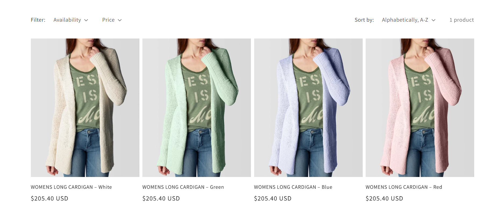
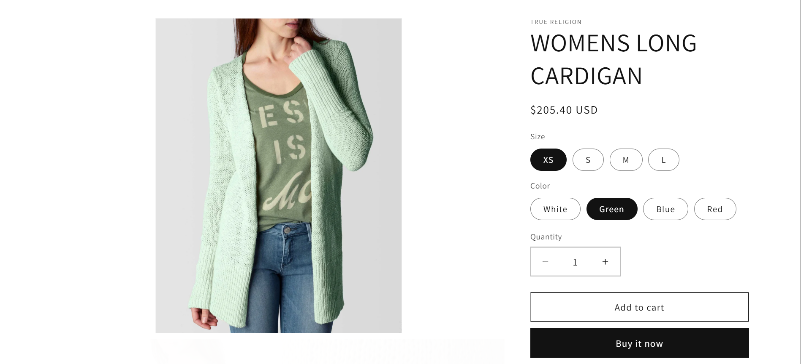

# Dawn Colour Variant Collection

A Shopify collection-page customisation by [Peter Aderinto](https://github.com/Peter-Aderinto), built on **Dawn 16.0.0**. Each product colour appears as a separate card with its own image, colour-labelled title, variant link and price.



## Project Overview

The project makes a product's colour choices visible directly in the collection grid. The implementation expands product cards on the server using Shopify Liquid and reuses Dawn's existing layout and components. It demonstrates targeted theme customisation, variant data handling, and reusable snippet design without adding a custom JavaScript layer.

For example, a T-shirt available in Red and Blue, each with three sizes, produces **two collection cards**. Each card shows its colour name, representative variant image and price, and links directly to that variant.

## Project Screenshots

The desktop collection above shows one product displayed as four colour cards. The product page below shows the Green colour selected in Dawn's existing product form.



These screenshots illustrate the interface; they do not establish that cart, checkout or every responsive interaction has been tested.

## Key Features

- One card per distinct `Color` or `Colour` option value, regardless of option position or capitalisation.
- Product titles include the colour, such as `T-shirt – Blue`.
- Variant-specific prices, compare-at prices, unit prices and availability badges.
- Direct variant URLs that select the corresponding variant on the product page.
- Image fallback from the selected variant to another size of the same colour, then to the product image.
- Existing Dawn responsive layouts, image ratios, vendor information, ratings and animations.
- Colour-aware native option filtering and compatibility with Dawn's quick-add controls.
- Normal product cards for products without a colour option.

## Custom implementation and upstream credit

[Dawn](https://github.com/Shopify/dawn/tree/v16.0.0) is created and maintained by **Shopify**. The base theme, its styling, JavaScript, accessibility features and theme editor controls are Shopify's work. The custom implementation by [Peter Aderinto](https://github.com/Peter-Aderinto) is the colour-card functionality in these files:

| File | Custom behaviour |
| --- | --- |
| [`sections/main-collection-product-grid.liquid`](sections/main-collection-product-grid.liquid) | Expands each product into colour cards, chooses representative variants, respects active native colour filters, and maintains card loading and animation order. |
| [`snippets/card-product.liquid`](snippets/card-product.liquid) | Accepts optional variant and colour inputs; uses colour-specific titles, media, prices, links and IDs; shares the product's bulk quick-add modal across its cards. |
| [`snippets/price.liquid`](snippets/price.liquid) | Accepts an explicit variant for exact pricing and unit pricing, while retaining existing defaults for other callers. |

No custom CSS or JavaScript was needed for this feature. The existing Dawn assets are reused. Some JSON templates and section groups contain saved configuration differences from the upstream release; these are not claimed as custom feature development.

## Technologies

| Technology | Role in the project |
| --- | --- |
| Shopify Liquid | Selects colour variants, renders cards and formats variant pricing on the server. |
| HTML | Uses Dawn's existing card structure and image/link markup. |
| Dawn CSS | Provides the responsive grid, card styles and image layouts. |
| Dawn vanilla JavaScript | Supplies existing filtering, quick-add and other theme interactions. |
| JSON theme templates | Configures sections and theme editor settings. |
| Shopify CLI / Theme Check | Supports development-store previews and static theme validation. |

This is a Shopify Online Store theme with no application server or custom build step.

## Implementation Details

1. The collection grid identifies a product option named `Color` or `Colour`.
2. It iterates over that option's distinct values and finds variants belonging to each colour.
3. It chooses the first available variant of that colour, or its first variant if all are unavailable. An option-value variant provides an additional fallback when available.
4. The product card receives that variant, the colour name and any image fallback. Optional inputs preserve the original behaviour in sections that do not supply a variant.
5. The price snippet uses the explicit variant rather than product-wide price aggregation. The displayed price and linked variant therefore agree.

| Card element | Variant-specific behaviour |
| --- | --- |
| Image | Uses the representative variant's media, then another size's image in the same colour, then the product image. |
| Title | Appends the colour to the product title, for example `T-shirt – Blue`. |
| Link | Uses the selected variant's URL, including its `?variant=` identifier. |
| Price | Displays the linked variant's exact price, applicable compare-at price and unit price. |

Each colour is represented once even when it has several sizes. The selected variant is the first available size in that colour, with a sold-out fallback; the card does not claim a minimum price across every size.

Standard quick add uses the variant URL when opening Dawn's option chooser. Bulk quick add retains the product-wide variant order list, with one shared modal per product. The generic secondary hover image is suppressed on colour cards because it could depict another colour.

## Setup and Preview

You need a Shopify development store with theme access, Git, and a Node.js version supported by the current [Shopify CLI installation guide](https://shopify.dev/docs/api/shopify-cli).

1. Clone the repository and open its theme root:

   ```sh
   git clone https://github.com/Peter-Aderinto/shopify-dawn-variant-collection.git
   cd shopify-dawn-variant-collection
   ```

2. Install Shopify CLI:

   ```sh
   npm install -g @shopify/cli@latest
   ```

3. Validate and start a development preview, replacing the example store address:

   ```sh
   shopify theme check
   shopify theme dev --store YOUR-STORE.myshopify.com
   ```

4. Authenticate when prompted. Open the preview URL printed by the CLI and visit `/collections/YOUR-COLLECTION-HANDLE`.

The CLI uses a development theme; this command does not publish the theme. See [Shopify's CLI documentation](https://shopify.dev/docs/storefronts/themes/tools/cli).

### Demo product setup

Create a product with `Colour` values `Red` and `Blue`, plus optional sizes. Assign an image to variants of each colour, set prices and inventory, publish the product to the Online Store channel, and add it to a collection. Use a collection template containing the main collection product grid. The collection should show two colour cards; a product with no colour option should still show one card.

Product records and standalone product photographs are not bundled in this repository; the screenshots show demonstration store content. Use your own or appropriately licensed content when setting up a store.

## Project structure

```text
assets/       Dawn styles, scripts and visual assets
config/       Theme settings schema and reviewed default settings
layout/       Theme layouts
locales/      Translation files
sections/     Page sections, including the collection grid
snippets/     Reusable components, including cards and pricing
templates/    Page templates
screenshots/  Collection and product-page screenshots
```

## Validation and limitations

The implementation-stage Theme Check inspected 155 files with **zero errors and nine existing warnings**. The same warnings were present before the custom changes. This is static validation, not proof of browser or cart behaviour. See the [manual verification checklist](README-colour-cards.md#store-verification-checklist).

- Pagination, result counts and sorting remain **product-based**. A page can contain more cards than its configured product count. Cards remain grouped by their parent product.
- The price is for the representative variant, not the minimum price across all sizes of a colour.
- Native `Color`/`Colour` option filters limit visible colours. Other filters retain Shopify's product-level semantics; this does not implement independent variant-level price or availability filtering.
- Accurate colour images require variant image assignments. A missing assignment can fall back to the parent product image.
- Localised option names other than `Color` and `Colour` are not recognised.
- Shopify limits the unpaginated `product.variants` array to 250 variants. The option-value fallback does not guarantee complete coverage for larger products. See [Shopify's high-variant guidance](https://shopify.dev/docs/storefronts/themes/product-merchandising/variants/support-high-variant-products).
- The supplied screenshots document desktop collection and product-page appearance. Interactive cart behaviour and mobile rendering have not been verified in this workspace. No live demo is claimed.

## License and attribution

The original Dawn code is copyright Shopify Inc. The exact license from the Dawn `v16.0.0` release is included in [`LICENSE.md`](LICENSE.md); it is Shopify's license, **not the MIT license**. Its use and distribution conditions continue to apply to the included theme. This project does not replace those terms with a new blanket license or claim authorship of the base theme.

This is an independent Shopify theme development project and portfolio customisation, not an official Shopify product or endorsement. It is intended for use with Shopify. Shopify describes Dawn as a reference that developers can clone and fork for theme development in its [official guidance](https://www.shopify.com/partners/blog/best-free-themes). The included license governs use and distribution; this repository does not grant broader rights to the original theme.
